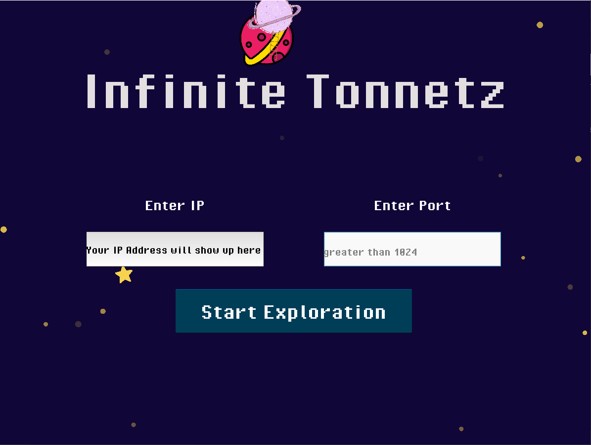

### Space travel with sounds

*Final project for 21M.385/6.185, Spring 2022*

by Lu Yu, Hanwen Zhang

In this project, we aim to explore “Synesthesia”: highlighting connections between music and visuals. We created a space, with both visual and musical components, which provides a smooth user experience for meditation.


##### Step 1: Set up for the environment

1. Softwares: [Miniconda](https://docs.conda.io/en/latest/miniconda.html), [Kivy](https://kivy.org/), [NumPy](https://numpy.org/), [pyAudio](http://people.csail.mit.edu/hubert/pyaudio/), and [FluidSynth](https://www.fluidsynth.org/)

2. *Windows only*: install the [ASIO drivers](https://www.asio4all.org/)

3. Get the app, one option is to use the following command

   ```bash
   git clone https://github.com/homework36/infinite-tonnetz.git
   cd code
   ```

4. Go to the app folder, install the required packages by running this command

   ```
   conda install --file requirements.txt
   ```

   

##### Step 2: Connect with your smartphone (full description [here](https://heliotrope-script-d84.notion.site/Send-OSC-from-phone-to-PC-55ec4f7e780e49d68cd78e8dade89ea5))

*** IMPORTANT: Make sure your phone and laptop/PC are connected to the same wireless network or hotspot***

Prerequisite: Find your IP on computer (MacOS user can first go to Step 3 and use the ip shown in the program)

1. Download and set up [ZIG SIM](https://1-10.github.io/zigsim/) on your phone

2. Turn on Bluetooth

3. On **Settings** tab in ZIG SIM, set the following configurations:

   a. ```Data destination```: other app

   b. ```Protocol```: UDP

   c. ```IP address```: the IPv4 address of the network your laptop/PC is connected to

   d. ```Port number```:  Pick a port from the list that is greater than 1024  

   e. ```Message format```: JSON

   f. ```Message rate (per sec)```: 10 (or greater)
   
   g. ```Device uuid```: <as is>

   h. ```Compass angle```: portrait

   i. ```Beacon```: <as is>

4. On **Sensor** tab, check ```GRAVITY``` and ```2D TOUCH```

##### Step 3: Run the code

From the ```infinite-tonnetz\code``` directory, run the following command:

- Mac users:

```bash
python main.py
```

- Windows users:

```bash
python main.py <IP address in step 2.3c> -asio
```

##### Step 4: Explore




There should be window popping out. Make sure to check the `IP address` and enter `Port number` on the opening screen to match what you have in step 2.3 and use your mouse to click on `Start Exploration`.


Spend some time playing with positions of your smartphones and navigate on the space. Try to move in all directions, get closer to or away from objects you see. 

The lines on the screen correspond to the basic transformations in the Neo-Riemannian Theory, and the entire mapping is essentially a tonnetz. When your plane cross a horizontal line, you change the chord to its parallel major (or minor), as the **P** in the graph below. Similarly, the line tilted to the left represents **R** and exchanges relative major and minor. The one tilted to the right, **L**, means leading tone exchange: In a major triad the root moves down by a semitone (C major to E minor), in a minor triad the fifth moves up by a semitone (E minor to C major).


Especially in the theory analysis for film music, you would jot down the current key area on the tonnetz, connect the path, and find an interesting trace such as the following:


Our app does the reverse: you pick a path, and we will output the corresponding harmonic progression for you. Try to experiment going in some directions on purpose. And when you cross the intersection of multiple lines, you can even do more than one transformation at a time.

*Reference for plots*: https://en.wikipedia.org/wiki/Neo-Riemannian_theory 
